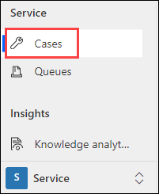
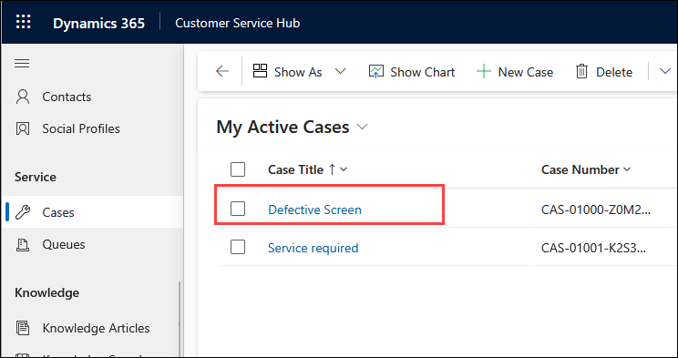
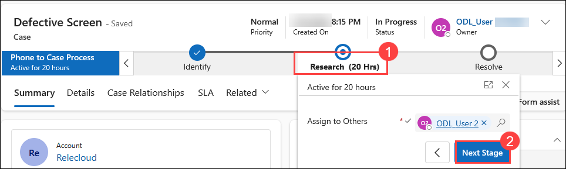
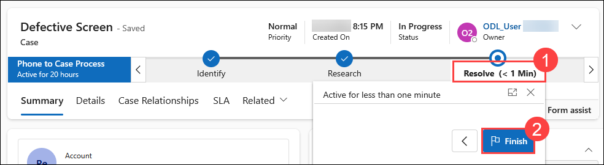
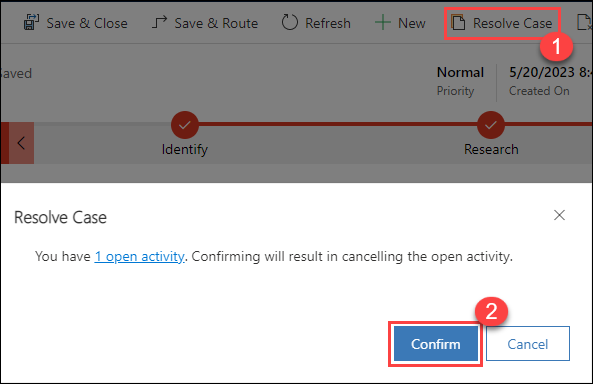
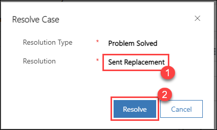
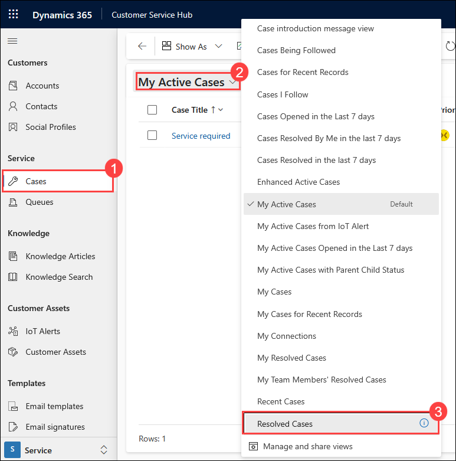
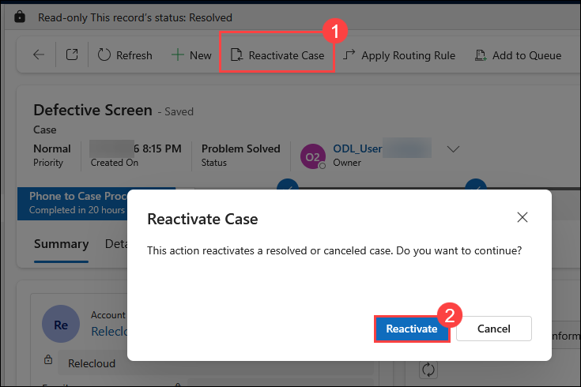
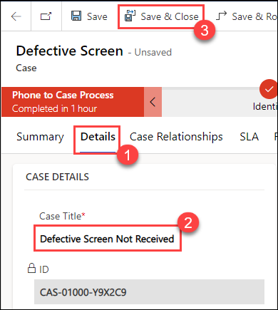

# Lab 03 – Resolving cases

## Lab scenario

You are a customer service manager at City Power & Light who has been tasked with trying the new case resolution and reactivation functionality before rolling it out to your users. In this lab, you will resolve a case and reactive that case.

## Lab objective
In this lab, you will perform:

+ Exercise 1 – Resolve Cases

## Estimated time: 20 minutes

## Exercise 1 – Resolve Cases

### Task 1 – Resolve Case

1.  Open the **Customer Service Hub** app.

1.  Click on **Cases** in the **Service** section of the sitemap.

    

1.  Open the **Defective Screen** case you created.

    

1.  Click on the **Research (1)** stage of the **Business Process Flow**, then click on **Next Stage (2)**.

    

1.  The **Business process Flow** will advance to the **Resolve** stage. Click on the **Resolve (1)** stage and click **Finish (2)**.

    

1.  Click on the **Resolve Case (1)** button located in the command bar. Note: You may need to click the ellipsis (...) to see the button.

1. A dialog will alert you that there is an open activity associated with this case, and resolving the case will result in cancelling the activity.

1. Click **Confirm (2)**.

    

1. Select **Problem Solved** for **Resolution Type** and enter **Sent Replacement (1)** for **Resolution** and click **Resolve (2)**.

    

### Task 2 – Reactivate Resolved Case

1.  Click **Cases (1)** under the **Service** section.

1.  To change the **View**, click on **My active Cases (2)** and change it to **Resolved Cases (3)** from the drop-down list.

    

1.  Open the case you resolved **Defective Screen** in task 1.

1.  Click on the **Reactivate Case (1)** button located in the command bar. A dialog will be displayed with the message to confirm, select **Reactivate (2)**.

    

1.  Change the **Case Title** to **Defective Screen Not Received (2)** in the **Details (1)** tab and then click on **Save & Close (3)**.

    

**Result:** You have successfully resolved the cases in this lab.  

### Review

In this lab, you have completed:
- Resolve cases 
- How to reactivate the resolved case
  
### Proceed with the next Lab.
