# Lab 04 – Routing cases

## Lab scenario

You are a customer service manager at City Power & Light who has been tasked with trying the new case routing functionality before rolling it out to your users. In this lab, you will create record creation rules, and case routing rules and test how they work.

## Lab objectives

In this lab, you will perform:
+ Exercise 1 – Configure record creation rules
+ Exercise 2 – Basic routing
+ Exercise 3 – Route cases

## Estimated time: 30 minutes
  
## Exercise 1 – Configure record creation rules

### Task 1 – Enable a case to be created from an email in a queue

1. Click on the **Customer Service Hub (1)** app from the top and select **Customer service admin center (2)**.

   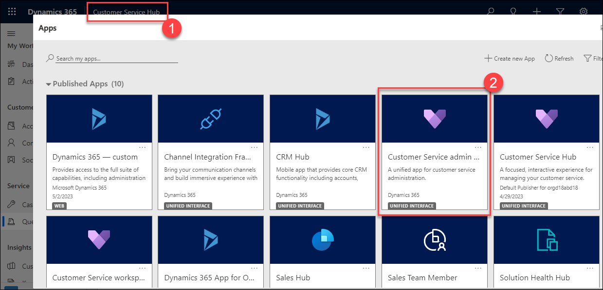
    
1. Using the navigation on the left, select **Case settings (1)**.

1. Select **Manage (2)** next to **Automatic record creation and update rules**.

   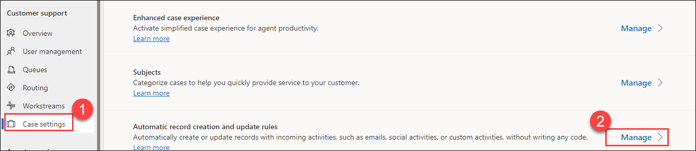

1. Click **+ New** located on the command bar.

   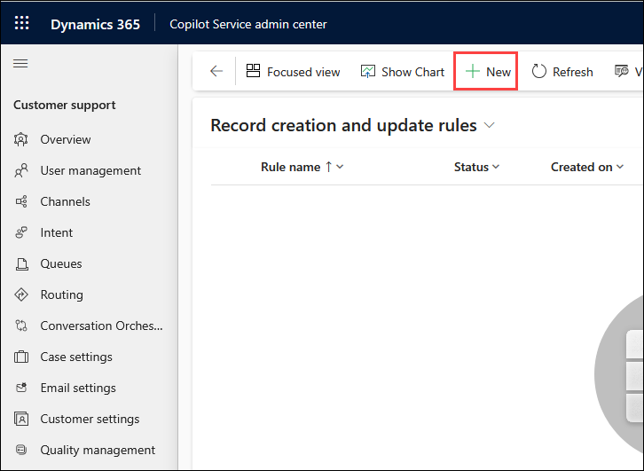

1. Enter the following details:

    - Rule name: **Support email (1)**
    - Queue scope: **Track single queue (2)**
    - Activity type to monitor: **Email (3)**
    - Queue to monitor: **Support (4)**

    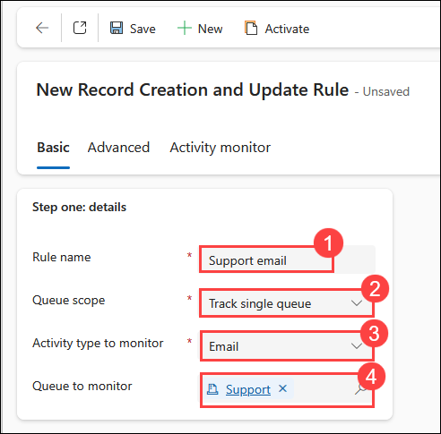
    
1. Click **Save**.

1. In **Step two: conditions to evaluate and actions to take**, click **+ New**.

   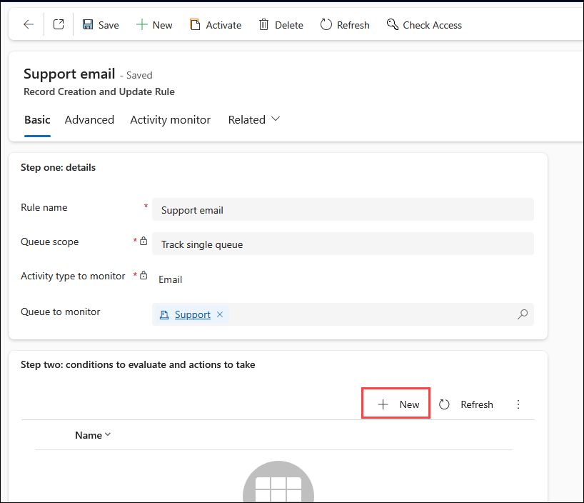

1. A new window will open, enter **High priority emails (1)** for **Condition name**. Click on **+ Add (2)** and then select **Add row (3)** from the drop-down.

   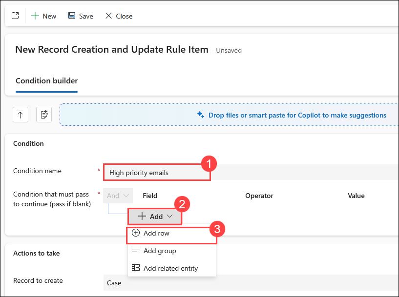

1. In the left-hand side of the condition, select **Priority (Email) (1)** from the drop-down.

1. Select **Equals** from the drop-down for the operator.

1. In the right-hand side of the condition, select **High** from the drop-down.

1. Click **Save and open Power Automate (2)**.

   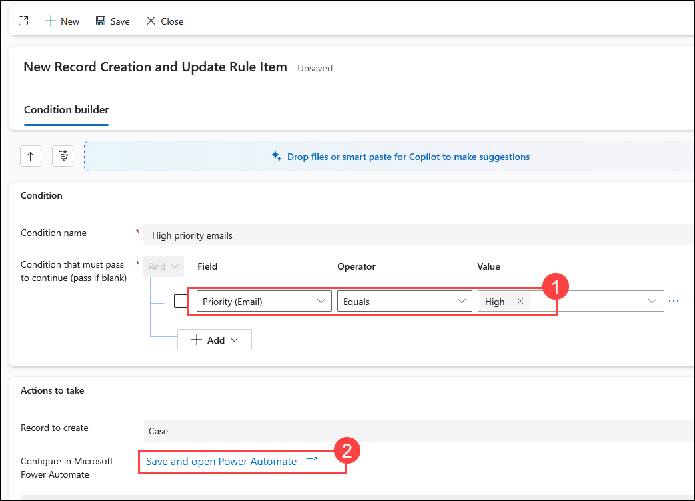

1. If not Sign-in, then enter following **Email/Username** and then click on **Next**. 

   - Email/Username: <inject key="AzureAdUserEmail"></inject>
   
1. Now, enter the following **Password** and click on **Sign in**.

   - Password: <inject key="AzureAdUserPassword"></inject>

1. If you see *Sorry, we weren't able to load your flow in the new designer experience*, click on **Return to classic designer**.

   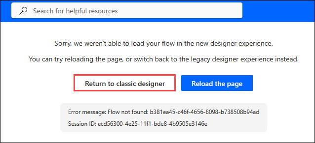
    
1. If prompted to connect to Microsoft Dataverse, click **Continue**.

   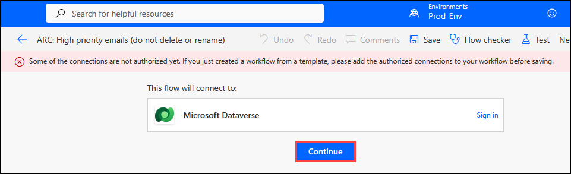

1. Expand the **Create a record (don't rename this step)** step.

   

1. Set the **Case Type** to **Request (1)**.

1. Set the **Priority field** to **High (2)**.

1. Click **Save (3)** and close the Power Automate browser tab.

   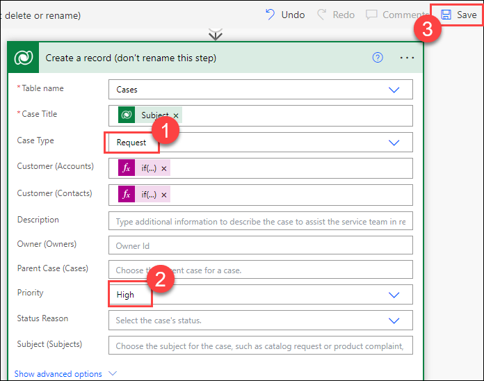

1. Navigate back to **Customer service admin center**, click **Close** in the *Record Creation and Update Rule Item* window.

   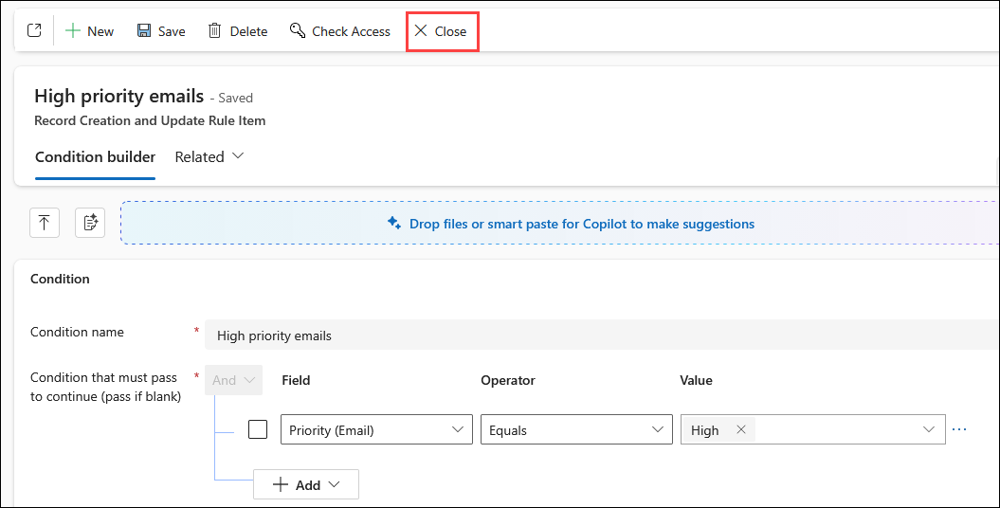

2. In **Step three: additional actions to take after matching with a condition**, set *Automatically reply to email* to **Yes (1)**.

1. In *Select email template*, search for and select **Case Auto Response (2)**.

1. Click **Save (3)**.

   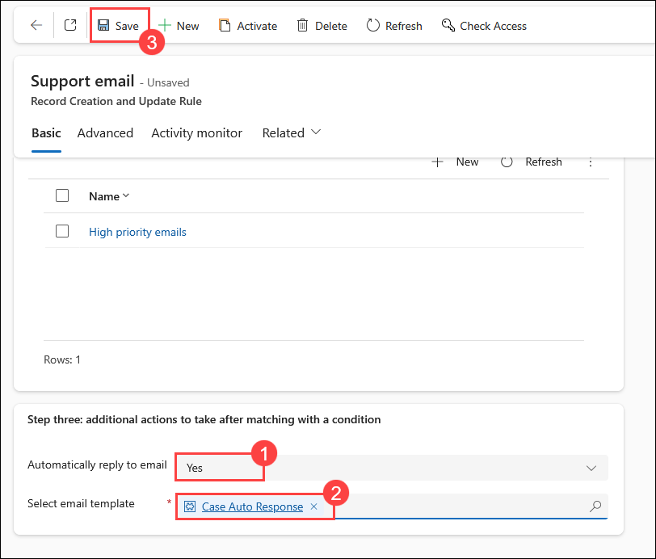

1. Click **Activate (1)** and then **Activate (2)** from popup.

   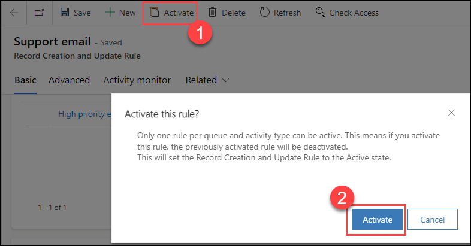

1. Due to the lack of administrative access to email mailboxes, you will not be able to test this rule.

## Exercise 2 – Basic routing

### Task 1 – Configure basic routing rule set

1. Click on the **Customer Service Hub (1)** app from the top and select **Customer service admin (2)**.

    
    
1. Click on **Routing (1)** in the **Customer support** section and then click on **Manage (2)** for **Basic routing rile sets**.

    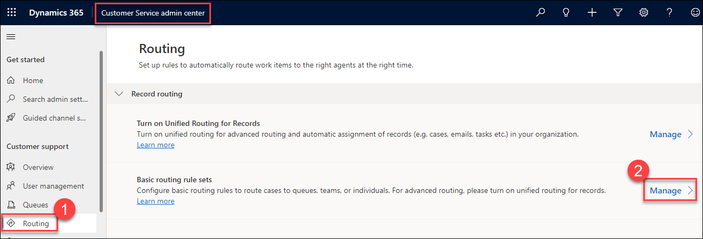

1. Click **+ New** located on the command bar.

1. Enter **Basic case routing rules (1)** for **Name** and then click on **Save (2)**.

    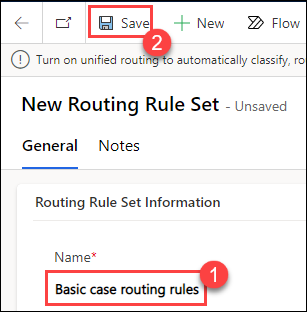

1. Click **+ New Rule Item**.

    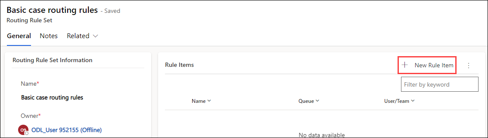

1. Click on **+ Add (1)** and **Add row (2)**.

   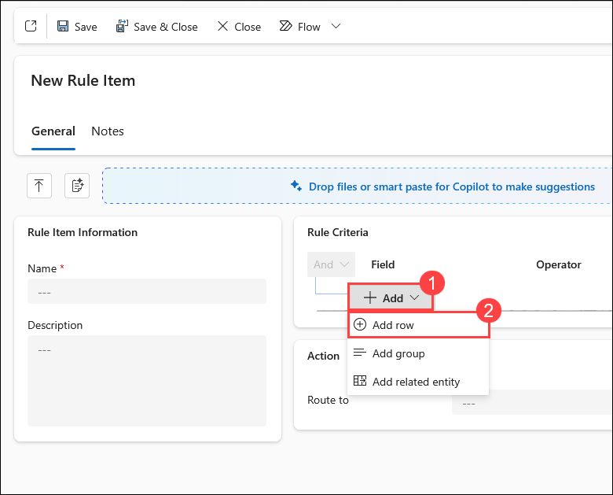
    
1. Enter **Problem (1)** for **Name**. Follow the below instructions:

    - In the left-hand side of the condition, select **Case Type (Case) (2)**. 
    - Select **Equals (3)** for the operator. For the condition, select **Problem (4)**.
    - Select **Queue (5)** for **Route To**.
    - Search for and select the **Gold (6)** queue you created in the earlier lab.
    - Click **Save & Close (7)**.

      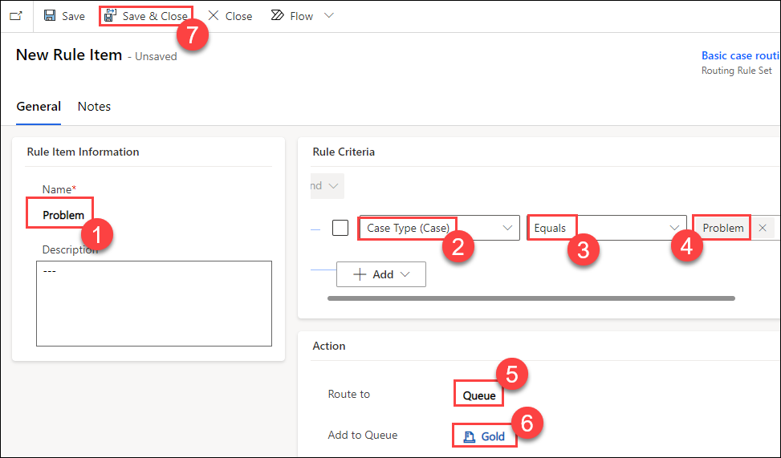

1. Click **+ New Rule Item**.

    - Enter **Maintenance (1)** for **Name**.
    - Click on **Add** and **Add row**.
    - In the left-hand side of the condition, select **Subject (Case) (2)**.
    - Select **Equals (3)** for the operator.
    - In the right-hand side of the condition, select **Maintenance (4)**.
    - Select **Queue (5)** for **Route To**.
    - Search for and select the **Silver (6)** queue you created in the earlier lab.
    - Click **Save & Close (7)**.

      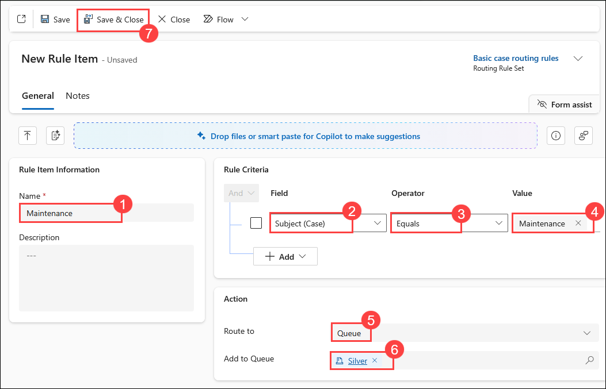

1. Click **+ New Rule Item**.

    - Enter **Questions and Requests (1)** for **Name**.
    - Click on **Add** and **Add row**.
    - In the left-hand side of the condition, select **Case Type (Case) (2)**.
    - Select **Equals (3)** for the operator.
    - For condition, select **Question (4)** and select **Request**.
    - Select **Queue (5)** for **Route To**.
    - Search for and select the **Bronze (6)** queue you created in the earlier lab.
    - Click **Save & Close (7)**.

      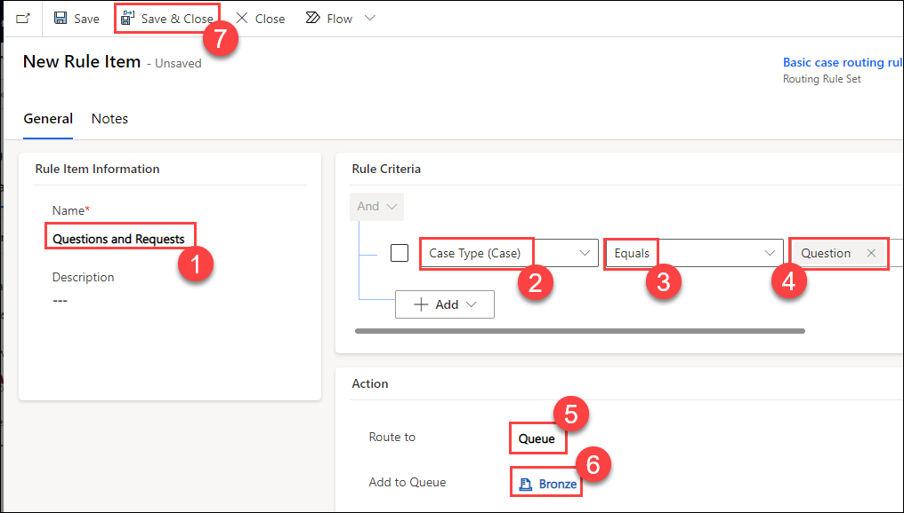

1. Click **Save**.

1. Click **Activate (1)** and click **Yes (2)**.

    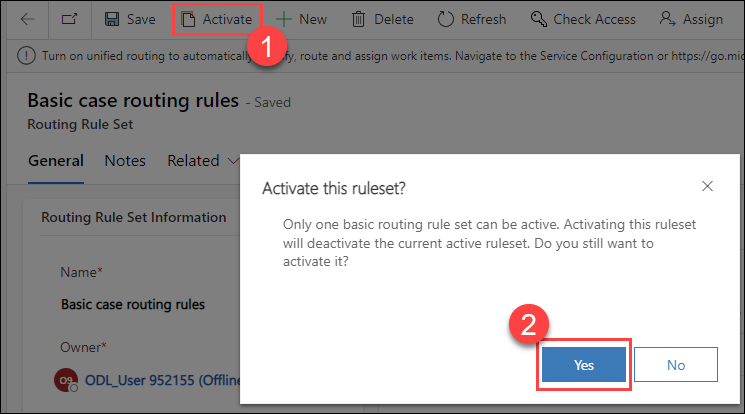

## Exercise 3 – Route cases

### Task 1 – Route cases

1. Open the **Customer Service Hub** app.

1. Click on **Home** at the top of the left-hand side navigation.

1. Click on **Cases (1)** in the **Service** section of the sitemap.

1. Open the **Defective Screen Not Received (2)** case you created.

    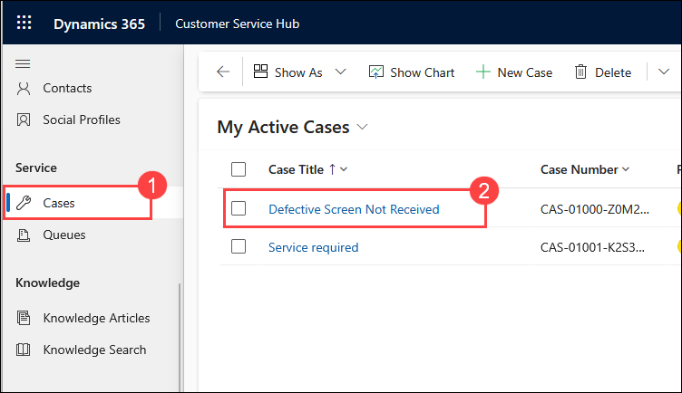

1. Click on **3 dots (1)** and select **Queue Item Details (2)** located on the command bar.

   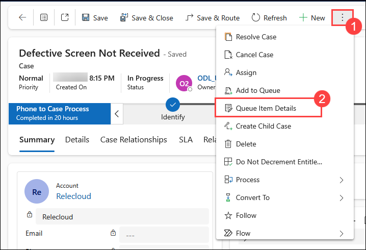

1. The following message should be displayed *This record is not added to any queue.*

1. Click **OK**.

    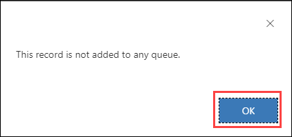

1. Click **Save & Route (1)** and click **Route (2)**.

    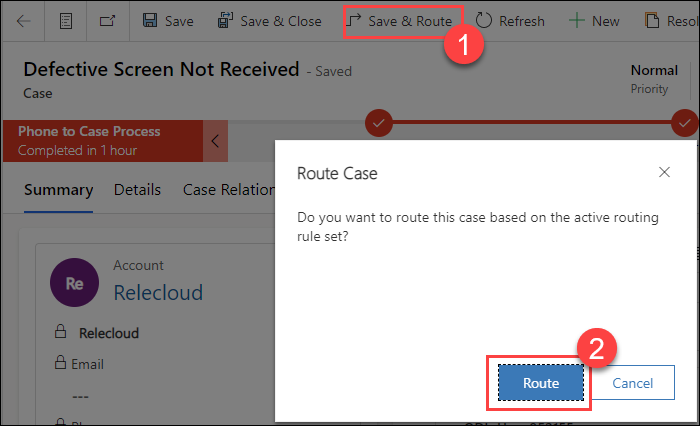

1. Open the **Defective Screen Not Received** case again.

1. Click on **3 dots (1)** and select **Queue Item Details (2)** located on the command bar.

   

1. The case will have been routed to the *Gold* queue because its **Case Type** is set to Problem.

    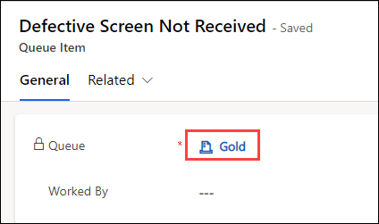

1. In the case view, click to the check-box left of the **Service Required (1)** case to select it. Click on **3 dots (2)** and select **Apply Routing Rule (3)** from the list.

    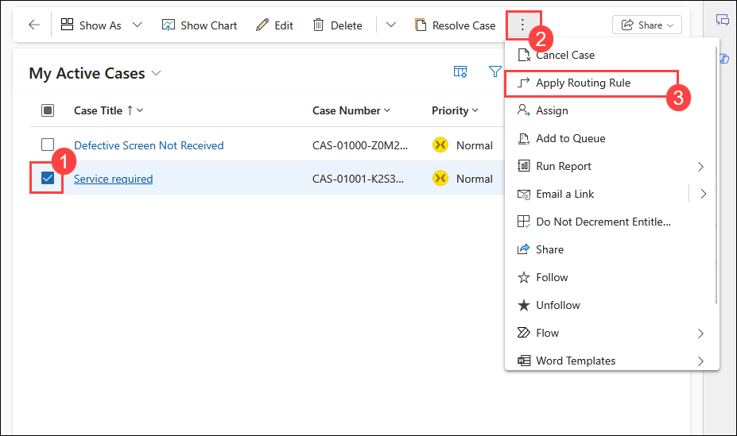

1. Click **Route** when the pop-up window shows up.

   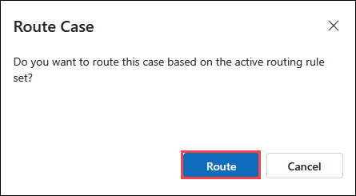

15. Open the **Service Required** case.

16. The case will have been routed to the *Bronze* queue because its **Case Subject** is set to Questions and Request.
    
**Result:** You have successfully Configured the basic routing rule set and created the route cases in this lab. 

### Review

In this lab, you have completed:

- Enable a case to be created from an email in a queue
- Configure basic routing rule set
- Created the route cases
  
### Proceed with the next Lab.
