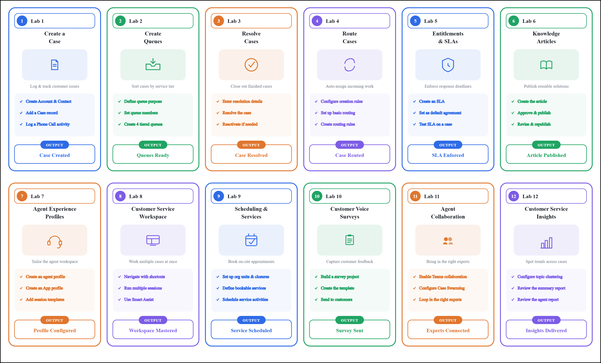
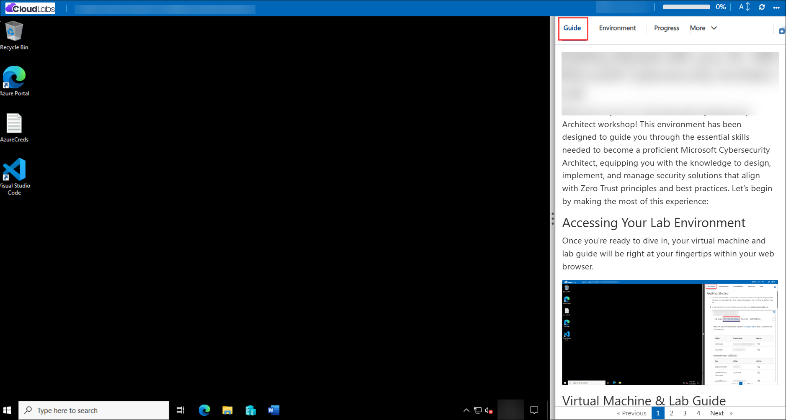
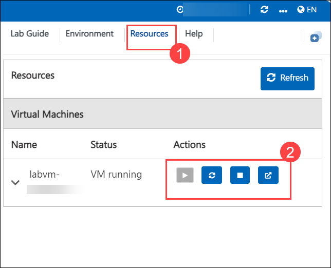
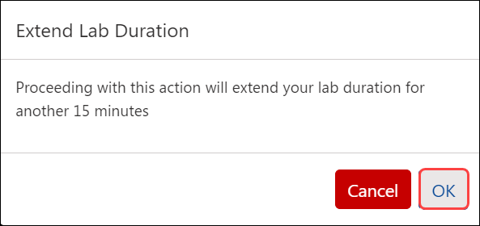

# Getting Started with Your MB-230-Dynamics365forCustomerService Workshop
 
Welcome to your MB-230-Dynamics365forCustomerService workshop! We've prepared a seamless environment for you to explore and learn about 
knowledge management, unified routing and queues, entitlements, resource scheduling, service- level agreements (SLAs), visualizations, connected services, Customer Service Insights, Power Virtual Agents etc. Let's begin by making the most of this experience:
 
## Overview

In these hands-on labs, you will develop the skills required to implement and manage customer service solutions using Microsoft Dynamics 365 Customer Service. Working as a Functional Consultant, you will set up a Dynamics 365 Customer Service environment and configure the core case management building blocks — cases, queues, entitlements, and service level agreements (SLAs) — before moving on to record creation and routing rules that automate how work reaches the right agents. The labs also cover knowledge management, agent experience profiles, App profiles, and the Customer Service workspace, giving agents the tools, scripts, and productivity features they need to resolve cases efficiently. Beyond core case handling, you will configure resource scheduling and services for on-site work, capture customer feedback with Customer Voice surveys, enable Agent Collaboration and Case Swarming for complex cases, and use Customer Service Insights to analyze topics and trends across your case data. By completing these labs, you will gain the practical experience needed to configure, customize, and operate an end-to-end Dynamics 365 Customer Service solution.

## Objectives

By the end of these labs, you will be able to:

1. **Set up a Dynamics 365 Customer Service environment:** Validate your tenant and provision a Production environment with Dataverse using the Power Platform admin center.

2. **Create and manage cases:** Create Account, Contact, and Case records, and add activities such as Phone Calls to a case to track customer interactions.

3. **Create and use queues:** Create queues (Support, Bronze, Silver, Gold) to organize and process incoming cases by service tier.

4. **Resolve and reactivate cases:** Resolve cases with appropriate resolution details and reactivate them when follow-up work is required.

5. **Configure record creation and routing rules:** Create record creation rules to automatically generate cases from incoming activities, and configure basic and rule-based routing so cases reach the correct queue or agent.

6. **Define Service Level Agreements (SLAs):** Create and set a default SLA, configure a holiday schedule and customer service schedule, and test SLA enforcement against cases.

7. **Manage knowledge articles:** Create, review, approve, publish, and revise Knowledge Articles to support agents and customers with self-service information.

8. **Configure Agent Experience and App profiles:** Create and test agent experience profiles and App profiles, including session templates and agent scripts, to tailor the Customer Service workspace for different agent roles.

9. **Navigate the Customer Service workspace:** Use shortcut keys, multi-session workflows, and the Productivity pane with Smart Assist to work efficiently across multiple cases.

10. **Configure Customer Service Scheduling and Services:** Set up organizational units, business closures, facilities/equipment, and define bookable services and resource requirements, then create and schedule service activities.

11. **Create and send Customer Voice surveys:** Build a survey project and template, and send surveys to capture customer feedback on case resolution.

12. **Enable Agent Collaboration and Case Swarming:** Turn on embedded Teams collaboration features and configure Case Swarming to bring the right experts together on complex cases.

13. **Use Customer Service Insights:** Configure topic clustering for cases and review analytics reports, including summary and agent-level KPIs, to identify trends and improve service delivery.

## Pre-requisites

- Basic understanding of Microsoft Dynamics 365 and the Power Platform.
- Familiarity with core customer service concepts such as cases, queues, and service level agreements is recommended.
- A Microsoft 365/Power Platform tenant with sufficient privileges to create environments, security roles, and Dataverse-based apps.
- General familiarity with navigating model-driven Power Apps and the Dynamics 365 Customer Service workspace will help learners get the most from this course.

## Architecture

The lab architecture demonstrates how Dynamics 365 Customer Service components work together to capture, route, resolve, and analyze customer service work end to end. Across the hands-on labs, you will provision a Customer Service environment, configure case management and automation, equip agents with productivity tools and knowledge, schedule on-site services, gather customer feedback, and analyze service performance.

1. **Create a Case:** In this lab, you will create a case in Dynamics 365 Customer Service, starting from an Account and Contact and logging a Phone Call activity against it.

2. **Create Queues:** In this lab, you will create queues (Support, Bronze, Silver, and Gold) to organize incoming cases by service tier.

3. **Resolve Cases:** In this lab, you will resolve a case with the appropriate resolution details and reactivate it when follow-up work is needed.

4. **Route Cases:** In this lab, you will configure record creation rules and case routing rules, then test basic routing so cases automatically reach the correct queue or agent.

5. **Entitlements & SLAs:** In this lab, you will create a Service Level Agreement, set it as the default agreement, configure a holiday schedule and customer service schedule, and test the SLA against a case.

6. **Knowledge Articles:** In this lab, you will create a Knowledge Article, submit it for review, approve and publish it, and then revise and republish it.

7. **Agent Experience Profiles:** In this lab, you will create an agent experience profile and an App profile, adding session templates and agent scripts to tailor the Customer Service workspace.

8. **Customer Service Workspace:** In this lab, you will navigate the Customer Service workspace using shortcut keys, work across multiple sessions, and use the Productivity pane and Smart Assist.

9. **Scheduling & Services:** In this lab, you will configure Customer Service Scheduling by setting up organizational units, business closures, and facility/equipment records, then define bookable services and schedule service activities.

10. **Customer Voice Surveys:** In this lab, you will build a Customer Voice survey project and template, then send it to capture customer feedback on case resolution.

11. **Agent Collaboration:** In this lab, you will enable embedded Teams collaboration features and configure Case Swarming to bring the right experts into a complex case.

12. **Customer Service Insights:** In this lab, you will configure topic clustering for cases and review the summary and agent-level reports in Customer Service Insights.

      

## Explanation of Components

1. **Cases, Accounts & Contacts:** Core Dataverse records that represent customers and the issues they raise, along with related activities such as phone calls.

2. **Queues:** Containers used to organize and prioritize incoming cases (for example, Support, Bronze, Silver, and Gold) so the right team works on the right items.

3. **Record Creation Rules & Routing Rules:** Automation that converts incoming activities into cases and directs cases to the appropriate queue or agent based on defined criteria.

4. **Service Level Agreements (SLAs):** Define and enforce response and resolution timeframes for cases, using holiday schedules and customer service schedules to account for business hours and closures.

5. **Knowledge Articles:** Structured content that goes through creation, approval, and publishing workflows to provide consistent, reusable solutions for agents and customers.

6. **Agent Experience Profiles & App Profiles:** Configuration that tailors the Customer Service workspace experience — including session templates and agent scripts — for different agent roles.

7. **Customer Service Workspace:** A multi-session, productivity-focused workspace with shortcut keys and the Productivity pane/Smart Assist to help agents manage several cases at once.

8. **Customer Service Scheduling (Resources & Services):** Organizational units, business closures, and facility/equipment records that support scheduling resources for services.

9. **Services & Service Activities:** Definitions of bookable services (such as an oil change or tire rotation) with their resource requirements, and the scheduled activities created from them.

10. **Customer Voice Surveys:** Survey projects and templates used to send feedback requests to customers and capture satisfaction data linked to cases.

11. **Agent Collaboration & Case Swarming:** Embedded Microsoft Teams collaboration features that let agents loop in colleagues or experts directly from a case, including swarming for complex issues.

12. **Customer Service Insights:** Analytics that apply topic clustering to case data and provide summary and agent-level reports for monitoring trends and performance.

## Accessing Your Lab Environment

Once you're ready to dive in, your virtual machine and **Guide** will be right at your fingertips within your web browser.

## Virtual Machine & Lab Guide

Your virtual machine is your workhorse throughout the workshop. The lab guide is your roadmap to success.

## Exploring Your Lab Resources

To get a better understanding of your lab resources and credentials, navigate to the **Environment** tab.

## Utilizing the Split Window Feature

For convenience, you can open the lab guide in a separate window by selecting the **Split Window** button from the top right corner.

## Managing Your Virtual Machine

Feel free to **Start, Restart, or Stop (2)** your virtual machine as needed from the **Resources (1)** tab. Your experience is in your hands!

## Lab Duration Extension

1. To extend the duration of the lab, kindly click the **Hourglass** icon in the top right corner of the lab environment. 

    

    >**Note:** You will get the **Hourglass** icon when 10 minutes are remaining in the lab.

2. Click **OK** to extend your lab duration.
 
   

3. If you have not extended the duration prior to when the lab is about to end, a pop-up will appear, giving you the option to extend. Click **OK** to proceed.

## Lab Progress

You can use the **Progress** tab to track your progress while working on the lab. A score will be provided after successful validation.

## Support Contact

The CloudLabs support team is available 24/7, 365 days a year, via email and live chat to ensure seamless assistance at any time. We offer dedicated support channels tailored specifically for both learners and instructors, ensuring that all your needs are promptly and efficiently addressed.

Learner Support Contacts:

   - Email Support: cloudlabs-support@spektrasystems.com
   - Live Chat Support: https://cloudlabs.ai/labs-support

Click **Next** from the bottom right corner to embark on your Lab journey!

Now you're all set to explore the powerful world of technology. Feel free to reach out if you have any questions along the way. Enjoy your workshop!